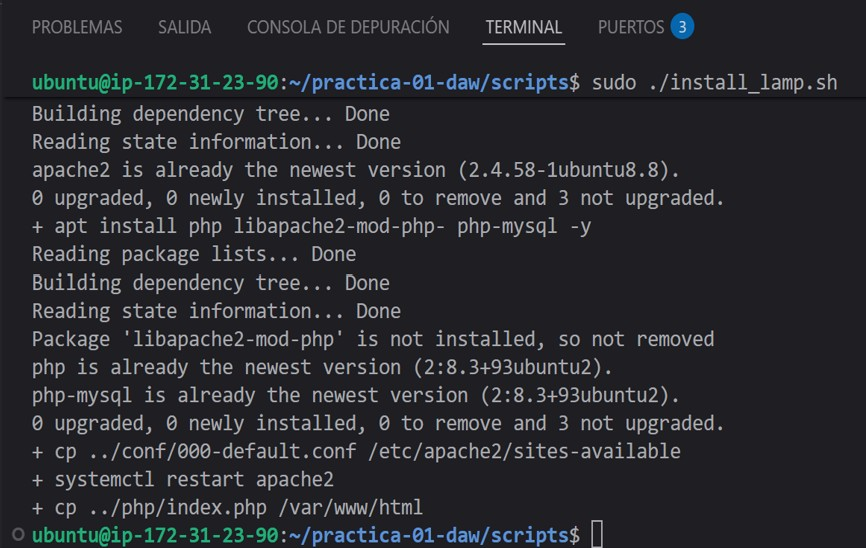
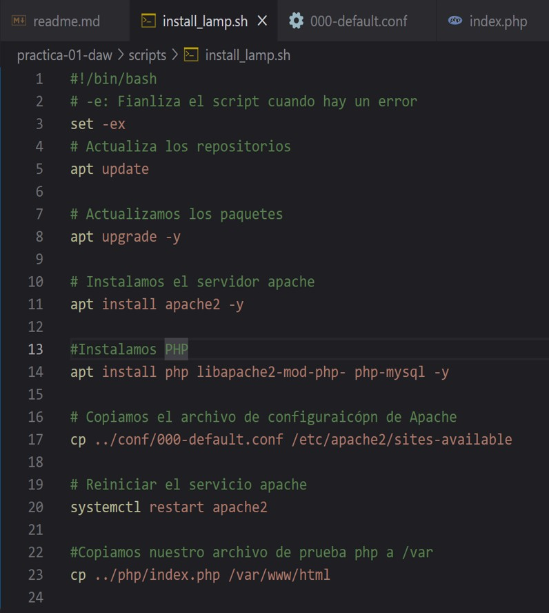
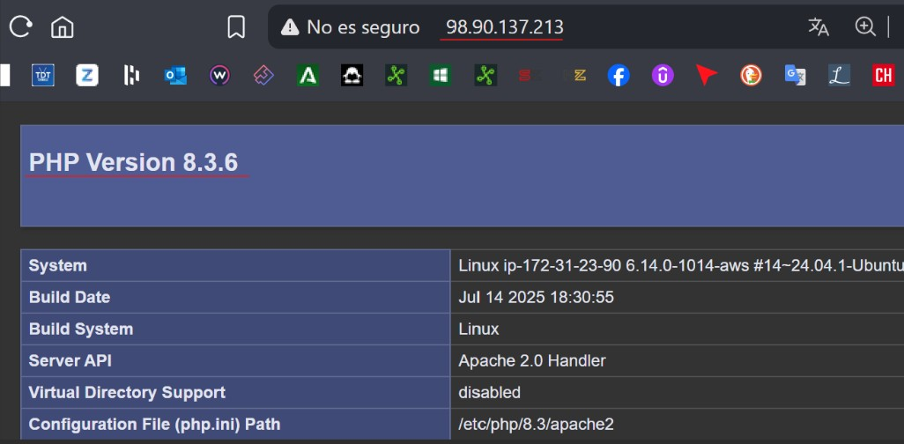

## 1º - Captura en la que finalizo con éxito la instalación de la pila LAMP en Ubuntu server 
para realizar un proyecto backend con php. También muestro los cambios guardados en mi 
repositorio de git-hub.

## 2º - PASOS PARA HACER EL SCRIPT DE LA PILA LAMP

1. **`set -ex`**  
   - **`-e`**: le dice al script que **se detenga si ocurre cualquier error**, evitando que siga ejecutando pasos que podrían fallar.  
   - **`-x`**: hace que **se muestren por pantalla cada comando antes de ejecutarlo**, útil para depurar o seguir el progreso.

2. **`apt update`**  
   Actualiza la **lista de paquetes disponibles** desde los repositorios de Ubuntu.

3. **`apt upgrade -y`**  
   Actualiza los **paquetes instalados a sus versiones más recientes**.  
   El parámetro `-y` **acepta automáticamente todas las confirmaciones**.

4. **`apt install apache2 -y`**  
   Instala el **servidor Apache**.  
   El parámetro `-y` evita tener que confirmar la instalación manualmente.

5. **`apt install php libapache2-mod-php php-mysql -y`**  
   Instala **PHP**, el lenguaje de programación del lado del servidor.  
   - `libapache2-mod-php` → permite que Apache interprete archivos PHP.  
   - `php-mysql` → permite que PHP se comunique con bases de datos **MySQL**, parte esencial de la pila LAMP.

6. **`cp ../conf/000-default.conf /etc/apache2/sites-available`**  
   Copia el **archivo de configuración personalizado de Apache** (`000-default.conf`) desde la carpeta del proyecto (`../conf/`) al directorio oficial de configuración de Apache (`/etc/apache2/sites-available`).  
   Este archivo sirve para configurar **el dominio, los permisos, el directorio raíz**, etc.

7. **`systemctl restart apache2`**  
   Reinicia el servicio **Apache** para aplicar los cambios y asegurarse de que el servidor esté funcionando correctamente.

8. **`cp ../php/index.php /var/www/html`**  
   Copia un **archivo PHP de prueba** (`index.php`) desde la carpeta del proyecto (`../php/`) al **directorio raíz del servidor web** (`/var/www/html`).  
   De esta forma, al abrir el dominio o la IP pública en el navegador, podemos **comprobar que PHP se ejecuta correctamente** antes que la página de información de Apache.

## 3º - COMPROBACIÓN DE LA IP PÚBLICA DEL SERVIDOR PHP

